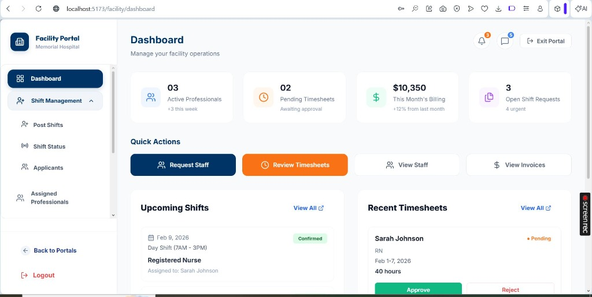
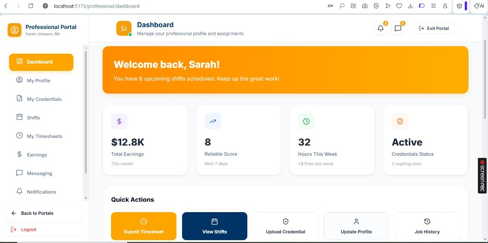

# 🏥 Healthcare Management & Professional Portal Dashboard

[](https://react.dev/)
[](https://vite.dev/)
[](https://tailwindcss.com/)
[](https://www.framer.com/motion/)

> A premium, modern dual-portal system designed for seamless healthcare facility management and professional shift tracking. Built with high-performance React 19 and Vite.

---

## 📸 Dashboard Preview

<p align="center">
  
  
</p>

---

## ✨ Features

### 🏢 Facility Portal
- **Dashboard Overview**: Real-time stats on active professionals, pending timesheets, and billing.
- **Shift Management**: Full lifecycle management of shifts—from posting to status tracking.
- **Applicant Tracking**: Review and manage professional applications with ease.
- **Assignment Monitoring**: Keep track of assigned professionals and their schedules.

### 🎖️ Professional Portal
- **Unified Profile**: Manage credentials, skills, and personal information in one place.
- **Shift Explorer**: Find and apply for shifts that match your schedule and expertise.
- **Earnings Insights**: Detailed breakdown of monthly earnings and reliable score tracking.
- **Secure Messaging**: Integrated communication platform for direct facility contact.

---

## 🧰 Tech Stack

- **Framework**: [React 19](https://react.dev/) + [Vite](https://vite.dev/)
- **State Management**: [React Context API](https://react.dev/learn/passing-data-deeply-with-context)
- **Styling**: Vanilla CSS (Custom Variable System)
- **Animations**: [Framer Motion](https://www.framer.com/motion/)
- **Icons**: [Lucide React](https://lucide.dev/)
- **Charts**: [Recharts](https://recharts.org/)
- **Routing**: [React Router DOM v7](https://reactrouter.com/)

---

## 📁 Project Structure

```text
src/
├── facility/         # Facility Portal pages and logic
├── professional/     # Professional Portal pages and logic
├── components/       # Shared UI components
├── assets/           # Static assets and styles
└── App.jsx           # Main routing and application entry
```

---

## 🚀 Quick Start

### Prerequisites
- [Node.js](https://nodejs.org/) (v18 or higher)
- [npm](https://www.npmjs.com/) or [yarn](https://yarnpkg.com/)

### Installation

1. **Clone the repository**
   ```bash
   git clone https://github.com/sanalashari03/Healthcare-Management-Professional-Portal-Dashboard.git
   cd Healthcare-Management-Professional-Portal-Dashboard
   ```

2. **Install dependencies**
   ```bash
   npm install
   ```

3. **Run the development server**
   ```bash
   npm run dev
   ```

---

## 🤝 Contributing

Contributions are welcome! Please feel free to submit a Pull Request.

---

## 👨‍💻 Author

**Sana Lashari**
- GitHub: [@sanalashari03](https://github.com/sanalashari03)
- Portfolio: [sanalashari.vercel.app](https://personal-portfolio-five-ivory-50.vercel.app/)
- LinkedIn: [Sana Lashari](https://www.linkedin.com/in/sana-lashari-135999330/)

---

## ⭐ Support

If you find this project helpful, please give it a ⭐ on GitHub!
